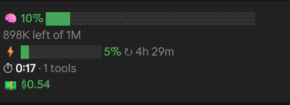

<div dir="rtl">

# claude-code-hud

**mod ל-Claude Code שמציג מעל תיבת הכתיבה את מה שבאמת חשוב לדעת תוך כדי עבודה: כמה מקום נשאר בחלון הקונטקסט, כמה נשאר ממכסת 5 השעות ומתי היא מתאפסת, כמה זמן לקח הפרומפט האחרון וכמה זמן עבדו כל הפרומפטים בסשן ביחד, וכמה עלה הסשן.**



עובד באפליקציית הדסקטופ (לשונית Code) ובטרמינל, ב-Windows, ב-Mac ובלינוקס.

## התקנה: שורה אחת

בתוך Claude Code (באפליקציה או בטרמינל), מדביקים בתיבת הכתיבה ושולחים:

```
/plugin install session-hud --marketplace ofeklevy11/claude-code-hud
```

מאשרים את ההתקנה, ופותחים סשן חדש. זהו.

<details>
<summary>לא עובד? אותו דבר בשתי פקודות, או מהטרמינל</summary>

בתוך Claude Code, אחת אחרי השנייה:

```
/plugin marketplace add ofeklevy11/claude-code-hud
/plugin install session-hud@claude-code-hud
```

או מהטרמינל, בלי לפתוח את Claude Code:

```bash
claude plugin marketplace add ofeklevy11/claude-code-hud && claude plugin install session-hud@claude-code-hud
```

אפשר גם פשוט לבקש מ-Claude: "תתקין לי את הפלאגין session-hud מה-marketplace ofeklevy11/claude-code-hud".

</details>

**צריך:** Claude Code בגרסה 2.1.287 ומעלה. מהגרסה הזו mods פועלים כברירת מחדל, בלי שום הגדרה.

## מה מקבלים

ארבעה כרטיסים זה לצד זה:

| כרטיס | מה הוא מציג |
|---|---|
| **🧠 Context window** | פס של מילוי חלון הקונטקסט באחוזים וכמה טוקנים נשארו, עם כפתור **Compact** שדוחס את השיחה בלחיצה. |
| **⚡ 5-hour limit** | פס של מכסת 5 השעות באחוזים, וכמה זמן נשאר עד שהיא מתאפסת. |
| **⏱ Prompt time** | שני שעונים: **now / last** הוא הזמן של פרומפט אחד, ו-**all** הוא סכום הזמן של כל הפרומפטים בסשן. |
| **💵 Session cost** | כמה הסשן עלה עד עכשיו, בדולרים. |

**צבעים והתראות:**
- הפסים ירוקים עד 60%, צהובים עד 85%, ואדומים מעל זה.
- כשפרומפט ארוך (2 דקות ומעלה) נגמר, קופצת הודעה.

**שני השעונים, ומה ההבדל ביניהם:**
- **now / last:** הזמן של פרומפט אחד, מהשליחה ועד ש-Claude סיים. בזמן שהוא עובד השעון רץ בתכלת ("now"). כשהוא מסיים, נשאר הזמן של הפרומפט האחרון ("last").
- **all:** סכום הזמנים של כל הפרומפטים בסשן. אם היו פרומפטים של 3, 7 ו-4 דקות, יופיע `14:00`. נספר רק הזמן ש-Claude עבד בפועל, בלי הזמן שבו הסשן חיכה לכם.

**💡 המלצה לדחוס את השיחה:** שיחה ארוכה מדי פוגעת באיכות התשובות, גם כשעוד נשאר מקום בחלון. לכן ה-mod ממליץ לדחוס הרבה לפני שהחלון מתמלא:
- **מעל 300K טוקנים:** מופיעה שורה צהובה "Compact recommended", והכפתור הופך ל-**Compact now**. קופצת גם הודעה, פעם אחת בכל פעם שעוברים את הסף.
- **מעל 400K טוקנים:** השורה הופכת לאדומה.
- **בחלון קטן מ-1M:** הספים הם 50% ו-70% מגודל החלון.

הספים מבוססים על כלל אצבע מקובל, שלפיו האיכות מתחילה לרדת בסביבות 300K עד 400K טוקנים. זה תלוי במשימה, אז זו המלצה ולא חוק.

**הפריסה מתאימה את עצמה לרוחב החלון:**
- **חלון רחב:** ארבעת הכרטיסים בשורה אחת.
- **חלון בינוני ו-split view:** שני הפסים זה לצד זה, ומתחתם שורה אחת עם השעונים והעלות.
- **חלון צר מאוד:** שורה קצרה לכל פס, מתחתן שורת השעונים והעלות, ובסוף כפתור הדחיסה. זו הפריסה שבצילום למעלה.

## למי זה עובד

| מצב | מה קורה |
|---|---|
| **מנוי Pro / Max** | הכול עובד. |
| **מפתח API במקום מנוי** | אין מכסת 5 שעות, אז הכרטיס ⚡ נשאר על "after the first reply". שאר הכרטיסים עובדים. |
| **💵 עלות במנוי** | זו העלות המשוערת לפי מחירי ה-API, לא כסף שיורד מהכרטיס. |
| **תוסף VS Code, `claude -p`, סשן בענן** | ה-mod רץ, אבל לא מוצג. התצוגה קיימת רק בטרמינל ובאפליקציית הדסקטופ. |

## עדכון והסרה

- **עדכון אוטומטי:** כבוי כברירת מחדל ב-marketplace שאינו של Anthropic. כדי להפעיל אותו: `/plugin`, לשונית **Marketplaces**, בוחרים `claude-code-hud`, ואז **Enable auto-update**.
- **עדכון ידני:** `/plugin`, לשונית **Installed**, בוחרים `session-hud`, ואז **Update now**.
- **הסרה:** `/plugin uninstall session-hud@claude-code-hud`.

## לא מופיע?

1. **פתחתם סשן חדש אחרי ההתקנה?** סשן שכבר היה פתוח לא טוען את ה-mod. אפשר גם להריץ בו `/reload-plugins`.
2. **גרסת Claude Code:** מריצים `claude --version` בטרמינל. צריך 2.1.287 ומעלה, ואם הגרסה ישנה יותר, מעדכנים.
3. **בדיקה שהוא נטען:** בטרמינל, `/plugin` מציג מתחת ללשוניות שורה כמו `1 mod active · session-hud`.
4. **ה-HUD מופיע פעמיים?** כנראה התקנתם בעבר גרסה ידנית. מחקו את `~/.claude/skills/session-hud` ואת `~/.claude/skills/context-meter`, אם הם קיימים.

## התאמה אישית

הקוד נמצא ב-`session-hud/hooks/register.tsx`:

- **ספי הצבעים:** הפונקציה `tone`.
- **ספי ההמלצה לדחוס:** הפונקציות `compactAt` ו-`compactHard` בראש הקובץ.
- **נקודות המעבר בין הפריסות:** הבדיקות `W >= 96` ו-`W >= 40` בסוף הקובץ.
- **להציג גם את המכסה השבועית:** הנתונים של `seven_day` כבר נשלפים, ונשאר רק להוסיף להם כרטיס.
- **מלכודת אחת:** לא לקרוא למשתנה בשם `h`. רכיבי ה-JSX נבנים דרך פונקציה בשם הזה, ומשתנה באותו שם מסתיר אותה. ה-mod קורס עם `h is not a function`.

**לפתח בלי להתקין:** `claude --plugin-dir ./session-hud` טוען את התיקייה לסשן אחד. אחרי כל שינוי מריצים `claude plugin validate ./session-hud`.

## פרטיות

ה-mod קורא רק נתונים שהסשן עצמו כבר מחזיק: מילוי הקונטקסט, מכסות התוכנית והעלות. הוא לא שולח שום דבר לשום מקום ולא כותב קבצים.

כמו כל mod, הוא רץ עם ההרשאות שלכם. אפשר לבדוק בדיוק מה הוא עושה לפני ההתקנה: `claude plugin validate ./session-hud` מציג את כל האירועים שהוא מאזין להם ואת כל הקריאות שהוא עושה.

## רישיון

MIT

</div>

---

## English

**Session Tracker** is a Claude Code mod that sits above the prompt box as four side-by-side cards:
- **🧠 Context window:** a fill bar, tokens left, and a **Compact** button. Past 300K tokens it recommends compacting, and past 400K it turns red.
- **⚡ 5-hour limit:** a fill bar and the time until the limit resets.
- **⏱ Prompt time:** two clocks. **now/last** is one prompt end to end. **all** is every prompt in the session added up, with idle time excluded.
- **💵 Session cost:** in USD.

**Install:** paste this into Claude Code (desktop app or terminal), then open a new session:

```
/plugin install session-hud --marketplace ofeklevy11/claude-code-hud
```

Requires Claude Code 2.1.287 or later, where mods are on by default. If the one-line install doesn't work, run `/plugin marketplace add ofeklevy11/claude-code-hud` first, then `/plugin install session-hud@claude-code-hud`.

**Update and uninstall:**
- Auto-update is off for third-party marketplaces. To turn it on: open `/plugin`, go to **Marketplaces**, select `claude-code-hud`, then **Enable auto-update**.
- To uninstall: `/plugin uninstall session-hud@claude-code-hud`.

**Showing twice?** Delete any old manual copy in `~/.claude/skills/session-hud` or `~/.claude/skills/context-meter`.

**Privacy:** the mod only reads session data. It writes no files and sends nothing anywhere. MIT licensed.
